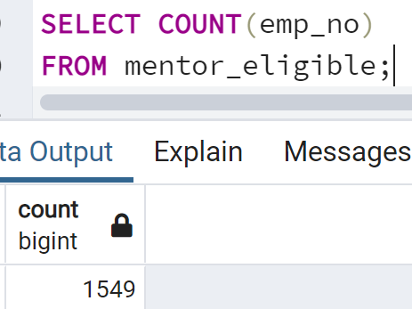

# Pewlett-Hackard-Analysis
## Project Overview

HR analyst for Pewlett-Hackard, Bobby, has been asked to transfer active employee information into a SQL database and then analyze the information.   
### Purpose
The purpose of the analysis is to prepare the company for upcoming retirements.  We will determine the number of retiring employees per title in the company to discover where there will be vacancies in the future.  We will also identify employees who are eligible to participate in a mentorship program that will help to fill those future vacancies.

## Resources
- Data Sources: departments.csv, dept_emp.csv, dept_manager.csv, employees.csv, salaries.csv, titles.csv
- Software: PostgreSQL 11.10

## Results
-	The title with the greatest number of upcoming vacancies is Senior Engineer with 29,414 upcoming retirements.  The following title with highest number of upcoming vacancies is Senior Staff with 28,254.  Only 2 employees with the title of manager are set to retire soon, making it the title with the lowest number of upcoming retirements.

-	Every title in the company has employees who will be retiring soon.
-	There are 1,549 employees eligible for the mentorship program.

-	Senior staff is the title with the most employees eligible for the mentorship program, 514, which closely follows the order of the number of retiring employees.  The next highest title is engineer with 462 employees eligible for the mentorship program.  There are no employees with the titles of manager who are eligible for the mentorship program. 

## Summary
-	There are 90,398 employees who will be eligible for retirement soon given the criteria from the challenge.
-	The title with the highest mentor-to-retiree ratio is assistant engineer, and each assistant engineer would have to train about 28 new hires. From there the number of trainees each mentor increases up to 132 per mentor for senior engineers.  I do not believe there will be enough mentors to train all the necessary new hires needed to replace the employees who will be retiring soon.

-	One additional result to investigate is the salaries of employees who will be retiring soon.  First I queried employee information, their department, and their salary and created a table with this information.  

From this table that was created we can then query either average salary or total salary or both by department.  This will help us know what kinds of changes in payroll to expect soon.
-	We saw earlier that there are 2 managers who are eligible for retirement.  It will be very beneficial to know which managers are retiring.  We can determine the managers eligible for retirement with the following query.

With this query we see that the managers eligible for retirement are from the ‘Sales’ and from the ‘Research’ departments.
